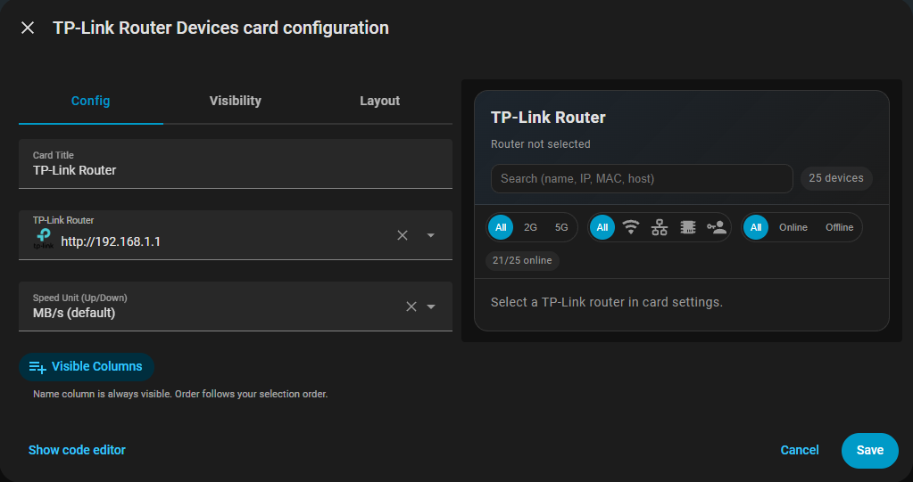
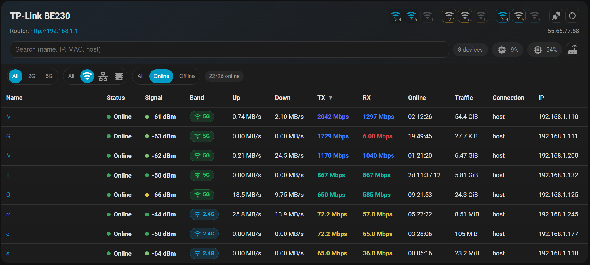

# TP-Link Router Card

Lovelace custom card for the `tplink_router` integration. It lists router clients in a fast, sortable table and adds router controls/insights in a compact header.

[](https://github.com/custom-components/hacs)
[](https://github.com/hepter/ha-tplink-router-card/releases)
[](LICENSE)





## Features
- Client table from `tplink_router` device_tracker entities.
- Multi-sort columns (Shift + click) with empty values always pinned to the bottom.
- Quick filters: band (2G/5G/6G), connection (WiFi/Wired/IoT/Guest), online/offline.
- Search supports name, IP, host, MAC.
- Signal dBm color scale.
- Traffic usage formatted as bytes.
- Up/Down unit selectable: MB/s (default) or Mbps.
- TX/RX link speed formatted as Mbps with proper scaling.
- Router header row:
  - Router URL opens in a new tab.
  - Hover tooltip on router URL shows model/manufacturer/firmware/hardware/MAC when available.
  - Public IP shown on the right when available.
  - CPU/MEM chips with hover tooltip.
- Action icons for WiFi/Guest/IoT/Router actions:
  - Destructive actions require hold (1s) with progress fill.
  - Shift + click on an action icon opens entity details.
- Router icon opens the HA device page in a new tab.
- i18n: English, Turkish

## Requirements
- Home Assistant with the **TP-Link Router** custom integration installed and configured.
- HACS (recommended) or manual resource install.

Dependency:
- `home-assistant-tplink-router` by AlexandrErohin: https://github.com/AlexandrErohin/home-assistant-tplink-router

## Installation

### HACS (recommended)
This card is a HACS **Dashboard** (Lovelace) plugin.

1. HACS → Integrations → `⋮` → **Custom repositories**.
2. Paste this repo URL and select **Dashboard**.
3. Install the card from HACS.
4. Add resource:
   - Settings → Dashboards → Resources → Add Resource
   - URL: `/hacsfiles/ha-tplink-router-card/ha-tplink-router-card.js`
   - Type: `JavaScript Module`

### Manual install
Download the file from the latest GitHub Release and copy it into your HA `/config/www/ha-tplink-router-card/` folder.

File to download:
- `ha-tplink-router-card.js`

Example path:
- `/config/www/ha-tplink-router-card/ha-tplink-router-card.js`

### CLI install
From your HA server:
```bash
cd /config/www/ha-tplink-router-card
wget https://github.com/hepter/ha-tplink-router-card/releases/download/v0.1.0/ha-tplink-router-card.js
```

### Add resource reference
If you configure Lovelace via YAML, add:
```yaml
resources:
  - url: /local/ha-tplink-router-card/ha-tplink-router-card.js?v=0.1.0
    type: module
```

If you use the UI:
1. Enable Advanced Mode in your user profile.
2. Settings → Dashboards → Resources → Add Resource.
3. URL: `/local/ha-tplink-router-card/ha-tplink-router-card.js`
4. Type: `JavaScript Module`

### Updating
- HACS: update from HACS UI.
- Manual: replace the local JS file with the latest release asset and bump the `?v=` version in the resource URL.

## Usage
Add a card and select your TP-Link router entry in the UI editor.

Minimal YAML:
```yaml
type: custom:tplink-router-card
```

Full config example:
```yaml
type: custom:tplink-router-card
title: "My Router"
entry_id: "<config_entry_id>"
speed_unit: "MBps" # MBps (default) or Mbps
columns:
  - status
  - connection
  - band
  - ip
  - mac
  - hostname
  - packetsSent
  - packetsReceived
  - up
  - down
  - tx
  - rx
  - online
  - traffic
  - signal
```

Notes:
- `entry_id` is selected in the card editor (TP-Link router integration entry).
- The `name` column is always visible and cannot be removed.
- Column order follows your selection order.

## Troubleshooting
- If router entries are missing, ensure you have admin rights (entity registry WS calls require it).
- If router info tooltip is empty, the integration might not expose device metadata. The card falls back gracefully.

## Contributing
Contributions are welcome. Please see `CONTRIBUTING.md` for guidelines and local setup.

## Credits
- TP-Link Router integration by AlexandrErohin (data source): https://github.com/AlexandrErohin/home-assistant-tplink-router
- Home Assistant community and UI framework.

## License
MIT. See `LICENSE` for details.
