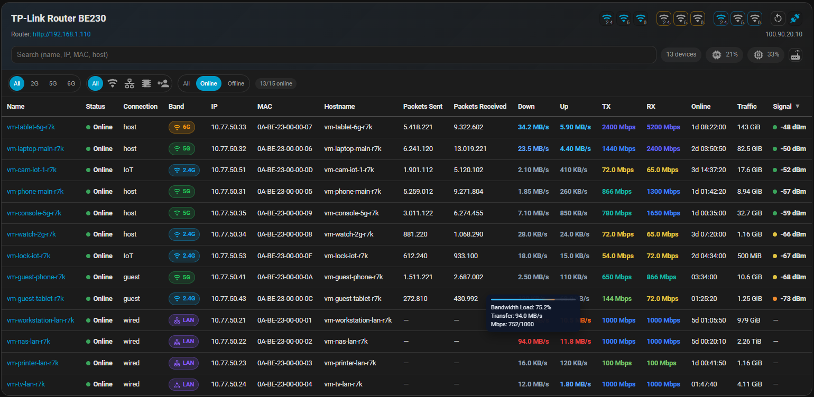
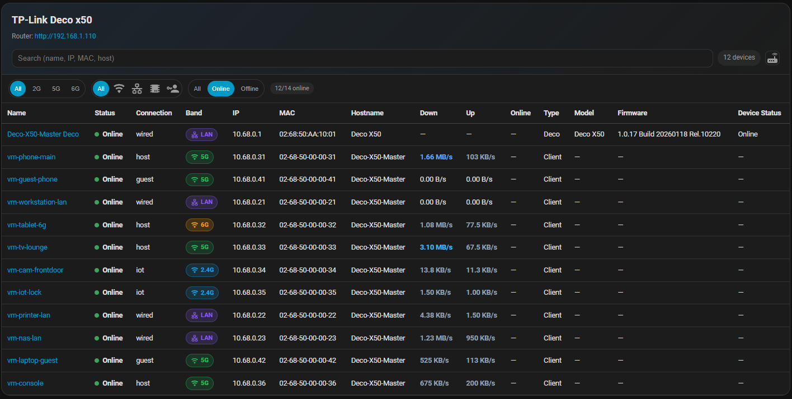
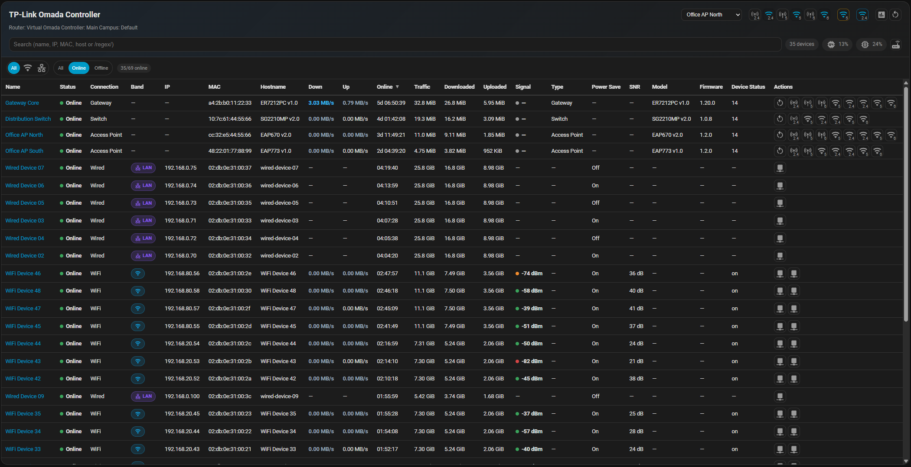
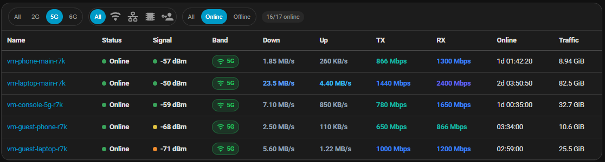
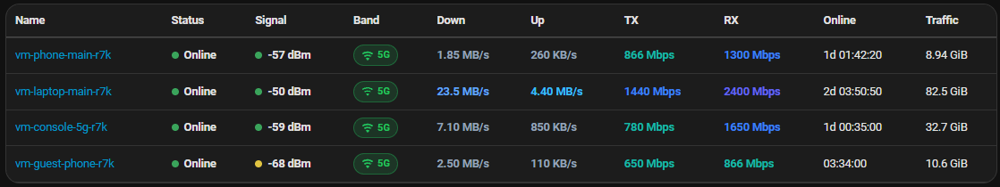
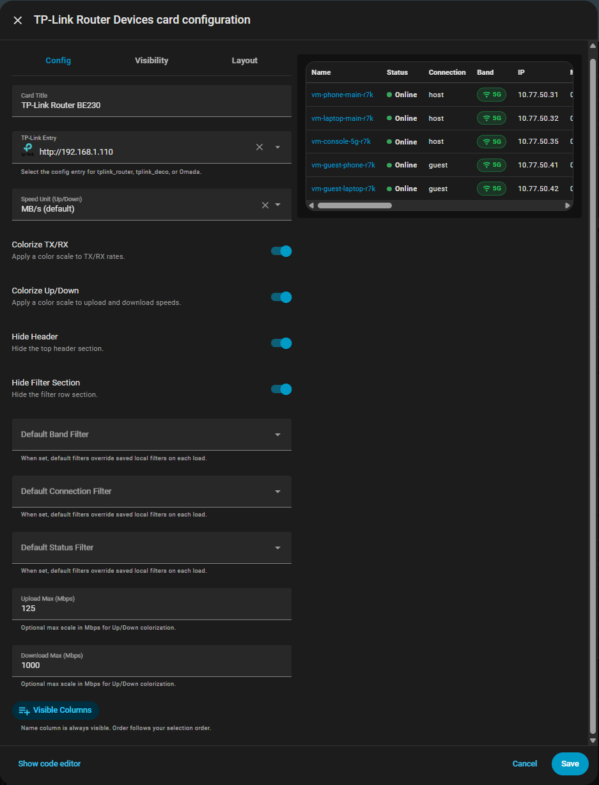

# HA TP-Link Router Card

[](https://github.com/custom-components/hacs)
[](https://github.com/hepter/ha-tplink-router-card/releases)
[](https://github.com/hepter/ha-tplink-router-card/blob/main/LICENSE)

A Lovelace card for Home Assistant focused on TP-Link client monitoring and quick router controls.



⭐ Found it useful? Please star the repo to support development and help others discover it.

## Highlights
- Live client table from router `device_tracker` entities.
- Fast search (name, IP, hostname, MAC) and compact quick filters.
- Multi-sort (Shift + click), with empty values always kept at the bottom.
- Strong formatting for traffic, link rates, duration, and signal quality.
- Router header with local URL, public IP, CPU/MEM summary, and quick actions.
- Hold-to-confirm safety for destructive actions (1 second).
- Built-in diagnostics export (redacted only).
- i18n support with automatic Home Assistant locale selection.
- Optional colorization for TX/RX and Up/Down speeds.
- Up/Down hover tooltip with utilization bar, Bandwidth Load, adaptive transfer unit, and current/max Mbps.

## Screenshots
`tplink_router`:


`tplink_deco`:



`omada` / `tplink_omada`:



Header variants (`hide_header` / `hide_filter_section` options):

Headless layout: the filter row stays visible while the header is hidden.



Headless + no filter layout: both header and filter row are hidden for a compact table-only card.



## Compatibility
- Supported integrations:
  - [`home-assistant-tplink-router`](https://github.com/AlexandrErohin/home-assistant-tplink-router) (`tplink_router`)
  - [`ha-tplink-deco`](https://github.com/amosyuen/ha-tplink-deco) (`tplink_deco`)
  - [`ha-omada`](https://github.com/zachcheatham/ha-omada) (`omada`)
  - Home Assistant Core `tplink_omada` (`tplink_omada`)

Support level summary:
- `tplink_router`: full support
- `tplink_deco`: high support
- `omada`: partial support
- `tplink_omada`: partial support

Detailed matrix: `docs/integration-support.md`

- `tplink_router`:
  - Full client table mapping from router tracker attributes.
  - Router action icons from exposed `switch.*` / `button.*` entities.

- `tplink_deco`:
  - Client/deco table mapping from `device_tracker.*` entities.
  - Supports `connection_type` and `interface` mapping.
  - Upload/download speed values are normalized automatically.
  - Action icons are shown only if `switch.*` or `button.*` entities are available in the selected entry.

- Omada (`omada` / `tplink_omada`):
  - Client listing support.
  - Partial action support when matching entities exist:
    - Reconnect
    - Start WLAN Optimization

Notes:
- Available actions and sensors depend on model, firmware, and integration-exposed entities.
- If an action cannot be matched safely, it is hidden by design.
- Integration-specific attributes are parsed with safe fallbacks. Missing fields never crash the card and are rendered as `—`.

## Installation

### 1. Add directly to HACS (recommended)

[](https://my.home-assistant.io/redirect/hacs_repository/?owner=hepter&repository=ha-tplink-router-card&category=plugin)

### 2. HACS (manual path)
1. Open HACS.
2. Add this repository as a **Dashboard** custom repository.
3. Install **HA TP-Link Router Card**.
4. Verify resource exists:
   - `/hacsfiles/ha-tplink-router-card/ha-tplink-router-card.js`
   - Type: `JavaScript Module`

### 3. Manual
Download the latest release asset and place it under:
- `/config/www/ha-tplink-router-card/ha-tplink-router-card.js`

CLI example:
```bash
mkdir -p /config/www/ha-tplink-router-card
wget -O /config/www/ha-tplink-router-card/ha-tplink-router-card.js \
  https://github.com/hepter/ha-tplink-router-card/releases/latest/download/ha-tplink-router-card.js
```

Add resource (YAML):
```yaml
resources:
  - url: /local/ha-tplink-router-card/ha-tplink-router-card.js?v=1
    type: module
```

UI path:
- Settings → Dashboards → Resources → Add Resource

## Configuration
Minimal:
```yaml
type: custom:tplink-router-card
```

Generic example:
```yaml
type: custom:tplink-router-card
title: My Router
entry_id: <config_entry_id>
speed_unit: MBps
txrx_color: true
updown_color: true
hide_header: false
hide_filter_section: false
default_filters:
  band: all
  connection: all
  status: all
upload_speed_color_max: 1000
download_speed_color_max: 100
columns:
  - status
  - connection
  - band
  - ip
  - mac
  - hostname
  - packetsSent
  - packetsReceived
  - down
  - up
  - tx
  - rx
  - online
  - traffic
  - signal
```

### Recommended column presets by integration

`name` is always shown automatically.  
For YAML users, set `columns` to show only the fields relevant to that integration.

`tplink_router` (recommended)
```yaml
type: custom:tplink-router-card
entry_id: <tplink_router_entry_id>
columns:
  - status
  - connection
  - band
  - ip
  - mac
  - hostname
  - packetsSent
  - packetsReceived
  - down
  - up
  - tx
  - rx
  - online
  - traffic
  - signal
```

`tplink_deco` (recommended)
```yaml
type: custom:tplink-router-card
entry_id: <tplink_deco_entry_id>
columns:
  - status
  - connection
  - band
  - ip
  - mac
  - hostname
  - down
  - up
  - online
  - deviceType
  - deviceModel
  - deviceFirmware
  - deviceStatus
```

`omada` / `tplink_omada` (recommended)
```yaml
type: custom:tplink-router-card
entry_id: <omada_entry_id>
columns:
  - status
  - connection
  - band
  - ip
  - mac
  - hostname
  - down
  - up
  - online
  - traffic
  - signal
  - deviceType
  - deviceModel
  - deviceFirmware
  - deviceStatus
```

Options:
- `title`: Card title.
- `entry_id`: Config entry to use. Selected from editor.
- `speed_unit`: `MBps` (default) or `Mbps` for Up/Down columns.
- `txrx_color`: Enable colorized TX/RX speed levels.
- `updown_color`: Enable colorized upload/download speeds.
- `hide_header`: Hide the header area.
- `hide_filter_section`: Hide the filter section.
- `default_filters`: Optional fixed default filters applied on every page load.
  - `band`: `all | 2g | 5g | 6g`
  - `connection`: `all | wifi | wired | iot | guest`
  - `status`: `all | online | offline`
- `upload_speed_color_max`: Upload color scale max in Mbps. Default `1000`.
- `download_speed_color_max`: Download color scale max in Mbps. Default `100`.
- `columns`: Optional column set and order.

Rules:
- `name` is always visible and cannot be removed.
- Column order follows `columns` order.
- Only columns valid for the selected integration domain are rendered.
- If `default_filters` is set, it overrides localStorage filter restore on every reload.
- `hide_filter_section` works well with `default_filters` for fixed filtered dashboards.


Editor preview:



## Diagnostics Export
When reporting a bug, attach a diagnostics dump:
1. Open the card.
2. Double-click the card title.
3. Click the download icon.
4. Attach the JSON file to your issue.

Export behavior:
- Output is redacted only.
- Sensitive values are masked (IP/MAC/URL/token-like values and sensitive keys).
- Includes card UI state (search text, filters, sorts) to reproduce behavior.
- Includes size/depth protection and truncation markers for very large payloads.
- For your security, review the file before attaching it to a public issue.

## Virtual Modem Lab
For local end-to-end testing with real integration setup flows, a virtual device lab is included:

- `virtual_modems/tplink_router_be230` (for `tplink_router`)
- `virtual_modems/tplink_deco_x50` (for `tplink_deco`)
- `virtual_modems/omada_controller` (shared by `omada` and `tplink_omada`)

See `virtual_modems/README.md` for setup and run commands.

## Troubleshooting
- Missing entries: ensure the integration is installed and the selected `entry_id` is correct.
- Empty table with a valid `entry_id`: check quick filters (`All / 2G / 5G / 6G`, `All / WiFi / Wired / IoT / Guest`, `All / Online / Offline`).
- Missing metadata/tooltips: some routers/integrations do not expose full router details.
- No action icons: action entities may be unsupported, unavailable, or intentionally filtered for safety.

## Contributing
See [`CONTRIBUTING.md`](CONTRIBUTING.md).

## License
MIT. See [`LICENSE`](LICENSE).
